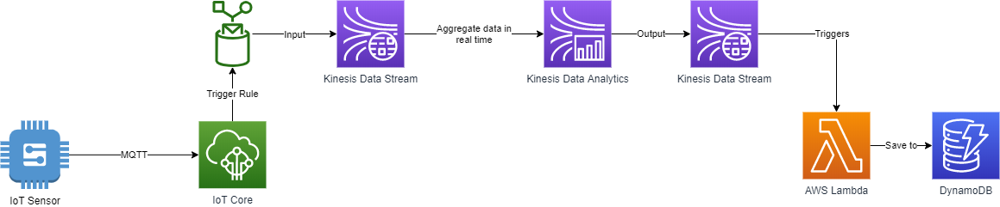

# SimpleDataPipeline

This application emulate sending of IoT data from Recommended-Fishing-Rivers-And-Streams dataset:
https://data.world/data-ny-gov/jcxg-7gnm/workspace/file?filename=recommended-fishing-rivers-and-streams-1.csv

The data is ingested by a stream pipeline, which then create an aggregate of the sum of records from the same County, at 5 minutes interval.
It will then save the aggregation to a database.

## System Overview



1. Simulation of an IoT sensor emitting MQTT data (NodeJS app)
2. IoT rule is triggered and push the data to Kinesis Data Stream
3. Kinesis Data Analytics application calcultes the aggregates from the input stream, and outputs it to another stream
4. AWS Lambda will pull data from the output stream and save it to DynamoDB

### Virtual IoT Device

The virtual IoT device will do the following:

1. Download data from the data set
2. Preprocess the data (remove spaces in keys and transform into JSON)
3. Send indefinitely the data at given frequency, in random order

Must set the configuration in [docker-compose.yml](./docker-compose.yml)

```yaml
environment:
    # URL where the data set .csv is
    DATA_SET_URL: https://query.data.world/s/azf67yuslxfmttps3f2sfrm3t4x4ya
    # Frequency to send messages in hz
    DATA_EMISSION_FREQUENCY_HZ: 10
    # Name of the sensor sending data in IoT MQTT topic
    SENSOR_NAME: SensorA
    # IoT MQTT endpoint. If empty, SDK will get the default one
    IOT_ENDPOINT: '' 
    # The following is required because we do not use a certificate, and use the Rest API for publishing MQTT data
    AWS_REGION: us-east-1
    AWS_ACCESS_KEY_ID: ${AWS_ACCESS_KEY_ID}
    AWS_SECRET_ACCESS_KEY: ${AWS_SECRET_ACCESS_KEY}
```

In normal cases, an IoT device should be registered in AWS IoT as a thing, and be assigned a x509 certificate, but for this project, using the SDK is good enough for simplicity sake.

The application is written in NodeJS, and is packaged as a Docker container.

#### Run the application

Prerequisites:
- Docker >v19

```sh
./build.sh

./stream.sh
```

#### Unit test

Prerequisites:
- Npm >v6.13.0
- Node >v8

```sh
./unit_test.sh
```

### Infrastructure

The infrastructure is deployed in Terraform and Cloudformation (Serverless Framework).

Terraform is used for creating the IoT Rule and the Kinesis pipeline (stream input, kinesis data analytics and stream output).
Serverless Framework is used for creating the data consumer that saves the data to a database using serverless services (Lambda and DynamoDB).

#### Deploy the infrastructure

Prerequisites:
- Npm >v6.13.0
- Node >v8
- Terraform >v0.12
- AWS CLI >v1.13.0
- Default AWS profile must have admin rights for easier deployment

```sh
./deploy.sh
```

This script will first deploy Terraform, then serverless (the latter is dependent on the first).

It does not save the state on a remote backend, nor use a lock mechanism. 

If you cannot use the AWS CLI to start the data analytics application (for example if you use Linux Academy cloud sandbox, it may explicity deny your AWS CLI), you will need to modify in [iac/modules/kinesis/main.tf](iac/modules/kinesis/main.tf) at the bottom:

```hcl
resource "null_resource" "start_application" {
  provisioner "local-exec" {
    command = "aws kinesisanalytics start-application --application-name ${aws_kinesis_analytics_application.app.name} --input-configurations Id=1.1,InputStartingPositionConfiguration={InputStartingPosition=NOW}"
  }
}
```

This will try to run the CLI to start the application (currently not supported in Terraform and there is a PR for this: https://github.com/terraform-providers/terraform-provider-aws/issues/7383)

You must remove this block if you cannot start the data analytics application programmatically, then rerun deploy.sh, and launch the Data Analaytics Application manually like described in the aforemented issue.
